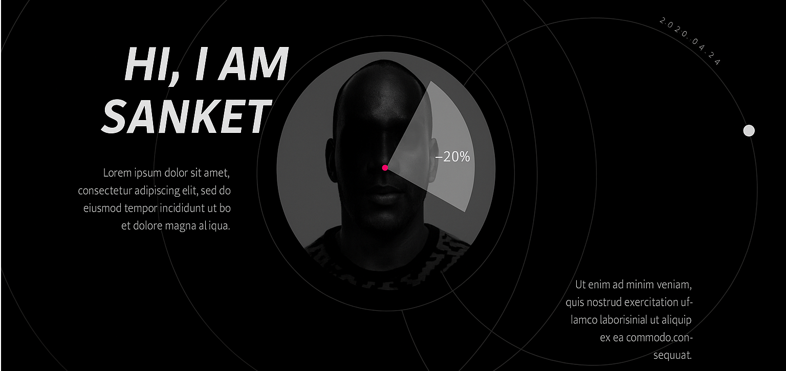

 
  
 
  

 

# About Me #

- 👨🏽‍💻 I’m currently pursuing B.Tech at IIIT Bhagalpur'25  
- 🌱 I’m currently exploring AI/ML.  
- 🤔 My interest lies in FullStack development and Data Structures and Algorithms
- 💬 Ask me about MERN Stack and DSA
- ❤️  Love to build new things and share knowledge
- 📧 Reach me out at : sanket.gautam33245@gmail.com

 

# My Skills #

# Github stats #

# Repositories

